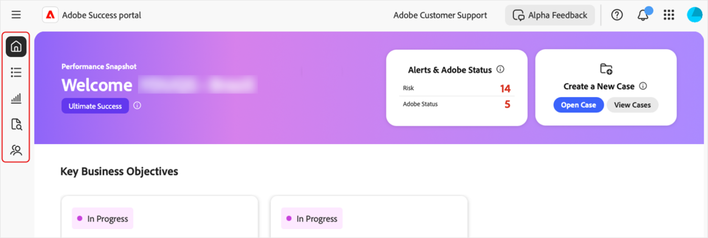

# Obtener acceso al portal [!DNL Adobe Success]

En esta guía se explica cómo iniciar sesión en el portal [!DNL Adobe Success] y recibir ayuda si se producen problemas de acceso.

Recibirá una notificación del equipo de **[!UICONTROL éxito]** del portal que confirme su acceso. Este mensaje incluye los detalles de inicio de sesión.

1. Vaya a https://experience.adobe.com/.
1. Inicie sesión con su Adobe ID.
1. Seleccione el icono del portal [!DNL Adobe Success] (Alpha).

   

1. Una vez que haya iniciado sesión, verá cinco pestañas:

   

   * Inicio
   * **[!UICONTROL Plan de acción]**
   * **[!UICONTROL Rastreador de valores]**
   * **[!UICONTROL Asistencia e información]**
   * **[!UICONTROL Plan de participación de soporte]**

## Solución de problemas y asistencia

Si tienes problemas para acceder al portal o a sus funciones, ponte en contacto con nuestro equipo mediante el [canal de Alpha Teams](https://teams.microsoft.com/l/channel/19:h-GcuAZs9uF05rervqTdx2U27ohYINuRUIfbMte9B-U1@thread.tacv2/General?groupId=02b87789-3475-47e4-94c1-0981f63ae89f&tenantId=fa7b1b5a-7b34-4387-94ae-d2c178decee1).   

Puedes usar el botón **[!UICONTROL Comentarios de Alpha]** del portal para enviar comentarios.

>[!NOTE]
>
>La herramienta de comentarios no es un canal de asistencia dedicado. No es adecuado para problemas de inicio de sesión urgentes.

