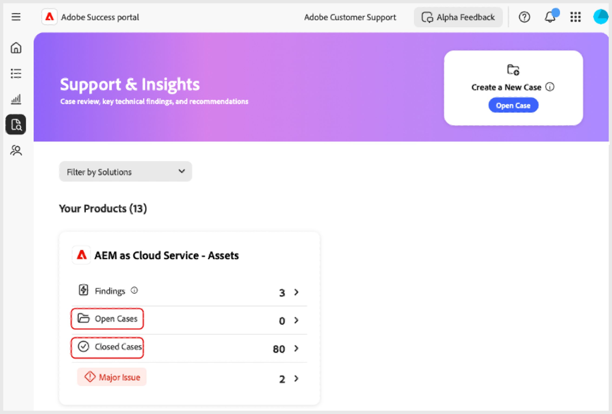

# Creación y administración de casos en el portal de [!DNL Adobe Success]

Esta guía explica cómo crear, ver y descargar informes para casos en el portal de [!DNL Adobe Success].

## Apertura de un caso

Puede abrir un caso desde la pestaña Inicio o desde la pestaña **[!UICONTROL Asistencia y datos]**.

Para acceder a la página **[!UICONTROL Abrir caso]** desde la pestaña Inicio, siga estos pasos:

1. Vaya a la pestaña Inicio.
1. Seleccione **[!UICONTROL Abrir caso]**.

   

1. Rellene los campos obligatorios:
   1. **[!UICONTROL Seleccione un producto]**.
   1. **[!UICONTROL Título del caso]**.
   1. **[!UICONTROL Descripción del caso]**.
1. Seleccione **[!UICONTROL Enviar caso]**.

   

Acceda a la página **[!UICONTROL Abrir caso]** desde la pestaña **[!UICONTROL Asistencia y datos]**.

1. Vaya a la pestaña **[!UICONTROL Asistencia y datos]**.
1. Seleccione **[!UICONTROL Abrir caso]**.

   

Siga los mismos pasos que se describen arriba para completar y enviar el caso.

## Visualización de un caso

Puede ver un caso en la pestaña Inicio o en la pestaña **[!UICONTROL Asistencia y datos]**.

Para acceder a la página **[!UICONTROL Ver casos]** desde la pestaña Inicio, siga estos pasos:

1. Vaya a la pestaña Inicio.
1. Seleccione **[!UICONTROL Ver casos]**.

   

1. Seleccione la tarjeta de producto que desee ver y, a continuación, elija **[!UICONTROL Casos abiertos]** o **[!UICONTROL Casos cerrados]**.

   >[!NOTE]
   >
   >También puede seleccionar la pestaña **[!UICONTROL Asistencia y datos]** para acceder con rapidez a las tarjetas de producto con vínculos a **[!UICONTROL Casos abiertos]** o **[!UICONTROL Casos cerrados]**.

   

1. Haga clic en **[!UICONTROL Número de caso]** para ver los detalles del caso.

   

## Descarga de informes de casos

Para descargar informes PDF sobre sus casos, siga estos pasos:

1. Vaya a la pestaña Inicio.
1. Seleccione **[!UICONTROL Ver casos]**.

   

1. Seleccione la tarjeta de producto que desee ver y, a continuación, elija **[!UICONTROL Casos abiertos]** o **[!UICONTROL Casos cerrados]**.

   >[!NOTE]
   >
   >También puede seleccionar la pestaña **[!UICONTROL Asistencia y datos]** para acceder con rapidez a las tarjetas de producto con vínculos a **[!UICONTROL Casos abiertos]** o **[!UICONTROL Casos cerrados]**.

   

1. En la página [Producto] - Casos de asistencia, seleccione la casilla que aparece junto al caso que desee descargar y **[!UICONTROL Descargar casos]**.

   
