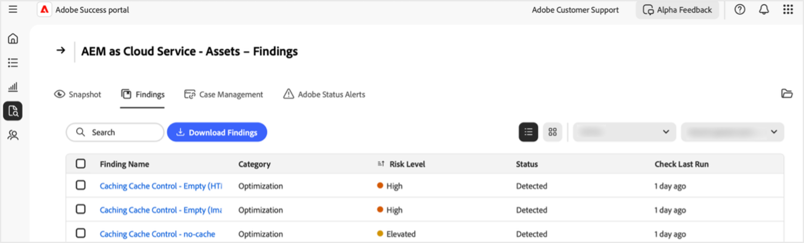

# Administrar resultados en el portal [!DNL Adobe Success]

En esta guía se explica cómo tener acceso, interpretar y actuar en función de los resultados del portal de [!DNL Adobe Success] para ayudarle a administrar de forma proactiva los riesgos de rendimiento, seguridad y funcionalidad del producto.

La página [!DNL Adobe Success]Conclusiones **[!UICONTROL del portal]** muestra los problemas o riesgos detectados en la instancia de producto de Adobe. Los resultados incluyen problemas de rendimiento, seguridad y funcionalidad, así como su estado y nivel de riesgo. La monitorización de esta página le ayuda a solucionar los problemas desde el principio, antes de que afecten a sus entornos.

**¿Cuáles son los resultados?**

Los resultados son alertas de Support Insights mostradas en el portal [!DNL Adobe Success]. Resaltan posibles problemas en la configuración del producto de Adobe, como ralentizaciones del rendimiento, riesgos de seguridad o configuraciones incorrectas. Estas alertas se basan en datos de telemetría recopilados de herramientas como las API, [!DNL New Relic] y [!DNL Splunk].

**¿Cómo se crean los resultados?**

Los equipos de Adobe estudian regularmente los problemas y las tendencias de soporte más comunes. En función de las perspectivas, añaden nuevas comprobaciones al sistema. Una vez al día, el portal [!DNL Adobe Success] analiza los datos de los productos para detectar problemas, como errores de configuración, trabajos atascados o cualquier cosa que pueda provocar una interrupción del sistema. Si una comprobación encuentra algo fuera del intervalo seguro (tal como lo definen los equipos de producto y soporte de Adobe), se muestra como un resultado.

**Por qué son importantes los resultados**

La revisión periódica de los resultados ayuda a detectar los problemas desde el principio, antes de que afecten al sistema o a los clientes. Este enfoque proactivo mejora la estabilidad del sistema, reduce el tiempo de inactividad y admite las prácticas recomendadas.

**Cómo corregir los resultados**

Cada hallazgo de incluye recomendaciones e instrucciones claras sobre cómo resolver el problema, junto con vínculos a la documentación relevante, si está disponible. Comparta estos resultados con su socio de TI, de ingeniería o de Adobe y trabaje en conjunto para solucionarlos. La solución temprana de estos problemas ayuda a evitar problemas mayores y mantiene el sistema funcionando sin problemas.

## Resultados del acceso

Para ver las perspectivas de un producto:

1. Vaya a **[!UICONTROL Asistencia e información]**.
1. Seleccione la tarjeta de producto correspondiente. Seleccione la ficha **[!UICONTROL Conclusiones]**.

   

1. Verá una lista de todos los resultados del producto seleccionado.

   

1. Desde aquí puede hacer lo siguiente:

   

   * Busque entradas específicas.
   * Exporte la lista de resultados seleccionando **[!UICONTROL Descargar resultados]**. Para exportar un informe para una búsqueda, seleccione la casilla de verificación situada junto a la búsqueda correspondiente en la columna **[!UICONTROL Nombre de búsqueda]**. Si no selecciona una búsqueda, la PDF contiene de forma predeterminada una lista de todas las conclusiones.
   * Vea los detalles de una búsqueda, incluida una resolución recomendada al seleccionar una búsqueda en **[!UICONTROL Nombre de búsqueda]**. La página Detalles de búsqueda muestra la búsqueda seleccionada con contexto adicional y una recomendación. Para ver este informe, seleccione la flecha de descarga.

     

## Conclusiones de la acción

Siga estos pasos para validar si cada resultado sigue siendo aplicable o puede ignorarse.

>[!NOTE]
>
>Las comprobaciones estándar se ejecutan en las instancias. Si las comprobaciones no determinan que el problema está presente en su instancia, hay un estado de **[!UICONTROL No detectado]**.

1. Vaya a **[!UICONTROL Asistencia e información]**.
1. Seleccione la tarjeta de producto correspondiente.
1. Abra la ficha **[!UICONTROL Conclusiones]**. Verá todos los resultados del producto seleccionado.
1. Seleccione una entrada bajo **[!UICONTROL Nombre de búsqueda]**. En la página Detalles de búsqueda puede:
   * Seleccione **[!UICONTROL Validar]** para comprobar si el problema sigue presente (el botón **[!UICONTROL Validar]** está diseñado para confirmar que el problema se ha resuelto):

   

   * Si el problema persiste, se mostrará el siguiente mensaje: *[!UICONTROL Validación completada. Se sigue encontrando]*. Utilice la información y la recomendación de la página Detalles de búsqueda para investigar y resolver.
   * Si el problema ya no está presente, se muestra el siguiente mensaje: *[!UICONTROL Validación completada. Ya no se detectó el hallazgo]*. Cuando el resultado ya no se detecta, el resultado se atenúa y el estado cambia a **[!UICONTROL No detectado]**. Los resultados con el estado **[!UICONTROL No detectado]** se encuentran en la parte inferior de la lista de resultados.
   * Si el problema no es aplicable ni relevante para usted, puede descartarlo seleccionando **[!UICONTROL Descartar]**. Cuando se descarta el resultado, el resultado se atenúa y el estado cambia a **[!UICONTROL Descartado]**.  Los resultados con el estado **[!UICONTROL Descartado]** se encuentran en la parte inferior de la lista de resultados.

## Comprender los resultados

* **[!UICONTROL Nombre de búsqueda]**: seleccione para obtener información detallada y pasos de resolución recomendados.
* **[!UICONTROL Tipo]** - Clasificado como *Funcionalidad*, *Rendimiento* y *Seguridad*.
* **[!UICONTROL Nivel de riesgo]** - Indicador de gravedad, con indicadores visuales.
* **[!UICONTROL Estado]** - Estado actual del hallazgo (por ejemplo, *Detectado*, *No detectado*, *Descartado*).
* **[!UICONTROL Comprobar última ejecución]**: marca de tiempo de la última comprobación que actualizó el resultado.

## Prácticas recomendadas

La página **[!UICONTROL Conclusiones]** enumera recomendaciones con los siguientes niveles de riesgo: **[!UICONTROL Alto]**, **[!UICONTROL Elevado]** y **[!UICONTROL Medium]**. **[!UICONTROL Alto]** es crítico, **[!UICONTROL Elevado]** es urgente y **[!UICONTROL Medium]** no es crítico. Para mantener el estado y el rendimiento del sitio:

* Aborde los hallazgos de **[!UICONTROL alto riesgo]** con prontitud, ya que representan amenazas críticas.
* Resuelva **[!UICONTROL problemas de riesgo elevado]** pronto para evitar la escalación.
* Supervise **[!UICONTROL Medium]** los resultados de los riesgos con regularidad y actúe según sea necesario.

