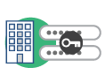

# Resumen de identidad

Se aplica a empresas y equipos.

El sistema Identity Management de Adobe ayuda a los administradores a crear y administrar el acceso del usuario a aplicaciones y servicios. Adobe ofrece estos tipos de identidad o cuentas para autenticar y autorizar a los usuarios.

## Tipos de identidad en Adobe Admin Console

Los tipos de identidad permiten a la organización diferentes niveles de control sobre las cuentas y los datos de los usuarios. La elección del modelo de identidad tiene un impacto considerable en la forma en que su organización almacena y comparte recursos. Aunque la organización crea y administra los modelos de Federated ID y Enterprise ID, el individuo crea y administra los Adobe ID.

La siguiente tabla le guía a la hora de elegir qué modelo de identidad se adapta mejor a su organización.

>[!NOTE]
>Si su organización no se ha actualizado al modelo de almacenamiento empresarial de Adobe y aún utiliza Adobe ID para personas, consulte la descripción en la [tabla de tipos de identidad](https://helpx.adobe.com/enterprise/using/identity.html#using-personal-adobe-id) a continuación.

<table>
<thead>
<tr>
<th scope="col">Tipos de identidad</th>

<th scope="col" style="text-align: center;">
   
  Federated ID
</th>
<th scope="col" style="text-align: center;">
   
  Enterprise ID
</th>
<th scope="col" style="text-align: center;">
   
  Adobe ID
</th>
</tr>
</thead>
<tbody>
<tr>
<th scope="row"><strong>Ofertas clave</strong></th>
<td>Creado, propiedad y administrado por la organización. La organización administra las credenciales de usuario y utiliza el inicio de sesión único (SSO) a través de un proveedor de identidad (IdP) de SAML2.</td>
<td>Creado, propiedad y administrado por la organización. La organización conserva derechos exclusivos para crear cuentas de usuario en dominios verificados.</td>
<td>Creado, propiedad y administrado por el usuario final. Adobe realiza la autenticación y el usuario final la administra. Según el <a href="https://helpx.adobe.com/enterprise/using/storage-for-business.html">modelo de almacenamiento</a>, los usuarios o las empresas conservan el control sobre los archivos y los datos. Las cuentas de Adobe ID se crean en dominios no verificados, públicos o de confianza. Consulte el punto 2 de la sección de la nota siguiente.</td>
</tr>
<tr>
<th scope="row"><strong>Cuenta y propiedad de datos</strong></th>
<td colspan="2">De propiedad y control de la organización</td>
<td>De propiedad de la organización para almacenamiento empresarial y de propiedad del usuario para almacenamiento de usuarios</td>
</tr>
<tr>
<th scope="row"><strong>Seguridad y monitorización</strong></th>
<td colspan="2">
  <ul>
    <li>Registros de auditoría</li>
    <li>Registros de contenido</li>
    <li>Restricciones de uso compartido</li>
    <li>Configuración de autenticación de la organización</li>
  </ul>
</td>

<td>
  <ul>
    <li>Registros de contenido</li>
    <li>Restricciones de uso compartido</li>
    <li>Política de contraseñas</li>
  </ul>
</td>

</tr>
<tr>
<th scope="row"><strong>Restablecer contraseña</strong></th>
<td colspan="2">No compatible</td>
<td><a href="https://helpx.adobe.com/manage-account/using/change-or-reset-password.html?lang=es">Restablecer la contraseña de la cuenta</a></td>
</tr>
<tr>
<th scope="row"><strong>Creative Cloud para empresas y Document Cloud para empresas</strong></th>
<td colspan="3">Admitido</td>
</tr>
<tr>
<th scope="row"><strong>Creative Cloud para equipos y Document Cloud para equipos</strong></th>
<td colspan="2">No compatible</td>
<td>Admitido</td>
</tr>
<tr>
<th scope="row"><strong>Experience Cloud</strong></th>
<td colspan="3">Admitido</td>
</tr>
<tr>
<th scope="row"><strong>Recomendado para</strong></th>
<td>
  <ul>
    <li>Organizaciones que ya utilizan SSO o SAML</li>
    <li>Servicios de directorio existentes (por ejemplo, Google y Azure AD)</li>
    <li>Requiere una integración sencilla con servicios que no sean de Adobe</li>
    <li>Puede demostrar la propiedad del dominio</li>
  </ul>
</td>
<td>
  <ul>
    <li>Puede demostrar la propiedad del dominio</li>
    <li>No requiere SSO</li>
  </ul>
</td>
<td>
  <ul>
    <li>Creative Cloud para equipos</li>
    <li>La organización prefiere utilizar dominios que no son de su propiedad</li>
    <li>Dominios públicos (por ejemplo, Hotmail o Gmail)</li>
    <li>Acceso a aplicaciones como Adobe Experience Manager Mobile</li>
  </ul>
</td>
</tr>
<tr>
<th scope="row"><strong>Introducción</strong></th>
<td><a href="https://helpx.adobe.com/es/enterprise/using/set-up-identity.html">Configurar identidad</a></td>
<td><a href="https://helpx.adobe.com/enterprise/using/add-domains-directories.html#claim-domains">Reclamar dominios</a></td>
<td><a href="https://helpx.adobe.com/enterprise/using/users.html#add-users">Adición de usuario</a></td>
</tr>
</tbody>
</table>

>[!NOTE]
>
>1. La directiva de contraseñas de Creative Cloud para equipos es la misma que la de Creative Cloud para particulares.
>1. Los usuarios de Adobe ID se autentican con sus credenciales de Adobe ID o mediante el modelo de autenticación de su propia organización (SSO, 2FA, etc.). En estos casos, se redirige a los usuarios a la página de SSO de la organización propietaria. Después de la autenticación, es posible que los usuarios tengan que [elegir un perfil profesional](https://helpx.adobe.com/enterprise/kb/enterprise-id-faq.html#choose-profile).

## Uso de Adobe ID personales

Adobe está actualizando todos los equipos y clientes empresariales para utilizar el modelo de almacenamiento empresarial de Adobe. Consulte la siguiente tabla si su organización tiene usuarios que utilizan un Adobe ID personal para acceder a las aplicaciones y servicios de Adobe de su empresa o centro educativo.

### Adobe ID personal

<table>
<thead>
<tr>
<th scope="col">Tipo de identidad</th>
</th>
<th scope="col" style="text-align: center;">
   
  Adobe ID personal
</th>
</tr>
</thead>
<tbody>
<tr>
<th scope="row"><strong>Ofertas clave</strong></th>
<td>Creado, propiedad y administrado por el usuario final. Adobe realiza la autenticación y el usuario final la administra.</td>
</tr>
<tr>
<th scope="row"><strong>Cuenta y propiedad de datos</strong></th>
<td>Controlado por el usuario</td>
</tr>
<tr>
<th scope="row"><strong>Seguridad y monitorización</strong></th>
<td>Política de contraseñas. Consulte el punto 1 de la sección de notas siguiente.</td>
</tr>
<tr>
<th scope="row"><strong>Restablecer contraseña</strong></th>
<td><a href="https://helpx.adobe.com/manage-account/using/change-or-reset-password.html?lang=es">Restablezca la contraseña de su cuenta.</a> Consulte el punto 2 de la sección de notas siguiente.</td>
</tr>
<tr>
<th scope="row"><strong>Creative Cloud para empresas y Document Cloud para empresas</strong></th>
<td>Admitido</td>
</tr>
<tr>
<th scope="row"><strong>Experience Cloud</strong></th>
<td>Admitido</td>
</tr>
<tr>
<th scope="row"><strong>Solo disponible para / Recomendado para</strong></th>
<td>
  <ul>
    <li>Clientes empresariales y de equipos incorporados antes de la migración</li>
    <li>Creative Cloud para equipos</li>
    <li>Desea tener el control en la mano del usuario</li>
    <li>Acceso a aplicaciones como Digital Publishing Suite</li>
    <li>Los usuarios son propietarios de los activos tras su separación de la organización</li>
  </ul>
</td>
</tr>
<tr>
<th scope="row"><strong>Introducción</strong></th>
<td><a href="https://helpx.adobe.com/enterprise/using/users.html#add-users">Adición de usuario</a></td>
</tr>
</tbody>
</table>

>[!NOTE]
>
>1. La directiva de contraseñas de Creative Cloud para equipos es la misma que la de Creative Cloud para particulares.
>1. Para los clientes de Creative Cloud para empresas que usan [almacenamiento empresarial](https://helpx.adobe.com/enterprise/using/manage-adobe-storage.html), los administradores pueden agregar usuarios de Adobe ID a Admin Console, pero no pueden agregarlos a perfiles de producto. Los administradores deben migrar a los usuarios de Adobe ID a otro tipo de identidad.
>1. Hay algunos productos y servicios, como el **Sitio web de licencias de Adobe, que solo admite** Adobe ID.

## Páginas similares

- [Configurar identidad](https://helpx.adobe.com/es/enterprise/using/set-up-identity.html)
- [Cambiar identidad de usuario](https://helpx.adobe.com/enterprise/using/switch-user-identity.html)
- [Información general de Admin Console](https://helpx.adobe.com/enterprise/using/admin-console-overview.html)
- [Preguntas frecuentes sobre educación](https://helpx.adobe.com/enterprise/using/education-faq.html)
- [Agregar y administrar usuarios](https://helpx.adobe.com/es/enterprise/using/users.html)