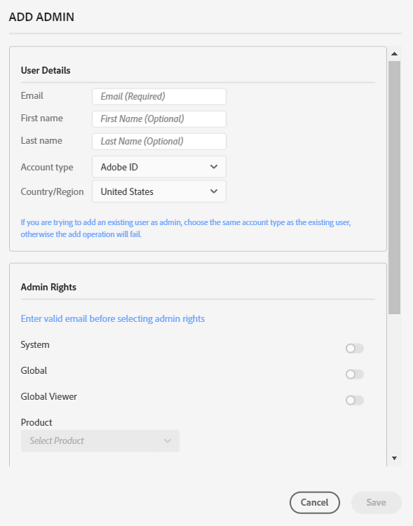

# Administración de administradores

*Se aplica a la empresa.*

Explore las funciones de administrador global y aprenda a delegar y distribuir la administración de usuarios, licencias de productos y grupos a administradores de cada organización individual.

En Global Admin Console, puede seleccionar una organización y navegar a la pestaña **[!UICONTROL Administradores]** para agregar, editar o eliminar derechos de administrador. Para obtener más información, consulte [Adoptar la administración global](https://helpx.adobe.com/enterprise/global-admin-console/adopt-global-administration.html). Vaya a [Global Admin Console](https://global-admin-console.adobe.com/) para iniciar sesión.

Global Admin Console introduce una función denominada administrador global. Esta función es distinta de un administrador del sistema y le permite hacer lo siguiente:

- Vea el panorama global de su inversión total en Adobe en todas las Admin Consoles agregadas a la jerarquía de Global Admin Console.
- Monitorice las asignaciones de licencias y recursos de Adobe y el uso en varias Admin Consoles.
- Cree Admin Consoles u organizaciones.
- Asigne licencias de producto de una Admin Console raíz o principal a Admin Consoles secundarias ubicadas debajo dentro de la jerarquía.
- Mantenga las operaciones diarias mientras los administradores del sistema siguen administrando sus propias Admin Consoles. Por ejemplo, un administrador global puede asignar un producto a un Admin Console secundario, pero no puede asignarlo a usuarios. El administrador del sistema recibirá los puestos dentro de su Admin Console y asignará los productos a sus usuarios.
- Opcionalmente, aplique directivas organizativas a cualquier Admin Consoles de la jerarquía.

## Tareas administrativas fundamentales

Global Admin Console está diseñado para funcionar en varias organizaciones y Admin Consoles. En la tabla siguiente se describen las diferentes funcionalidades y dónde se pueden completar: Admin Console o Global Admin Console.

<table>
  <tr>
    <th colspan="2">Tarea</th>
    <th>Global Admin Console</th>
    <th>Admin Console</th>
  </tr>

<tr>
    <td colspan="2">Crear, crear y eliminar organizaciones secundarias</td>
    <td align="center">Sí</td>
    <td align="center">No</td>
  </tr>

<tr>
    <td colspan="2">Trabajar con varias organizaciones</td>
    <td align="center">Sí</td>
    <td align="center">No</td>
  </tr>

<tr>
    <td rowspan="2" valign="middle">Administración de administradores</td>
    <td>Para una o más organizaciones</td>
    <td align="center">Sí</td>
    <td align="center">No</td>
  </tr>

<tr>
    <td>Para una organización</td>
    <td align="center">Sí</td>
    <td align="center">Sí</td>
  </tr>

<tr>
    <td colspan="2">Administración de perfiles de producto y grupos de usuarios</td>
    <td align="center">Sí</td>
    <td align="center">Sí</td>
  </tr>

<tr>
    <td colspan="2">Definir y administrar directivas</td>
    <td align="center">Sí</td>
    <td align="center">No</td>
  </tr>

<tr>
    <td colspan="2">Asignación de productos entre organizaciones</td>
    <td align="center">Sí</td>
    <td align="center">No</td>
  </tr>

<tr>
    <td colspan="2">Asignar productos a usuarios</td>
    <td align="center">No</td>
    <td align="center">Sí</td>
  </tr>

<tr>
    <td colspan="2">Administrar usuarios</td>
    <td align="center">No</td>
    <td align="center">Sí</td>
  </tr>

<tr>
    <td colspan="2">Administración de paquetes</td>
    <td align="center">No</td>
    <td align="center">Sí</td>
  </tr>

<tr>
    <td colspan="2">Configurar dominios y directorios</td>
    <td align="center">No</td>
    <td align="center">Sí</td>
  </tr>

<tr>
    <td colspan="2">Administración del almacenamiento y el cifrado empresariales</td>
    <td align="center">No</td>
    <td align="center">Sí</td>
  </tr>
</table>

## Administración de administradores

Puede crear una jerarquía administrativa flexible que permita una administración precisa del acceso y el uso de los productos de Adobe. Al igual que Adobe Admin Console, Global Admin Console le permite agregar administradores del sistema, administradores de productos, administradores de perfiles de productos, administradores de grupos de usuarios, administradores de implementación, administradores de asistencia y administradores de almacenamiento. Estos administradores pueden realizar sus respectivas tareas administrativas en las organizaciones de las que son administradores. Aparte de estas funciones, hay dos nuevas funciones para la administración global: global admin y global viewer.

La administración global es una función transitiva. Convertir a un usuario en administrador global de una organización lo convierte automáticamente en administrador global de todos los elementos secundarios de esa organización, directa o indirectamente. Además, si se crea una nueva organización en la jerarquía de organizaciones, todos los administradores globales de cualquier organización principal de esa organización se convertirán inmediatamente en administradores globales de la organización recién creada.

Las siguientes son las capacidades de la función de administrador global:

- Creación y eliminación de organizaciones secundarias
- Definir y editar directivas
- Definición y modificación de funciones administrativas
- Adición y eliminación de productos en organizaciones secundarias
- Establecer o cambiar asignaciones de recursos para organizaciones secundarias
- Administración de perfiles de producto y grupos de usuarios

Las siguientes son las capacidades de la función Visor global:

- Vea la lista de grupos de usuarios, productos, perfiles de producto, administradores, conjuntos de directivas y recursos en la organización y en las organizaciones secundarias.

## Administración distribuida

Al administrar los administradores, un administrador global puede delegar y distribuir la administración de usuarios, licencias de productos y grupos a los administradores de cada organización individual. El administrador añadido a una organización por un administrador global tiene la flexibilidad de gestionar la organización sin tener visibilidad de la administración de otras organizaciones. Por lo tanto, el administrador global puede delegar la administración de recursos y usuarios manteniendo aislados los datos de esos recursos y usuarios.

Un administrador global puede crear organizaciones, distribuir recursos como productos y almacenamiento a esas organizaciones, administrar la configuración de identidad y crear y aplicar plantillas de directivas de organización. Un administrador del sistema agregado a una organización por un administrador global puede asignar productos a usuarios, incorporar usuarios, crear y administrar perfiles de producto y realizar otras tareas administrativas dentro de esa organización.

## Añadir un administrador

1. En [Global Admin Console](https://global-admin-console.adobe.com/), seleccione una organización para editar y luego vaya a la pestaña **[!UICONTROL Administradores]**.

1. Seleccione **[!UICONTROL Agregar administrador]**.

   

1. En el cuadro de diálogo **[!UICONTROL Agregar administrador]**, escriba los **[!UICONTROL detalles del usuario]**: correo electrónico, nombre, apellidos, tipo de cuenta y código de país.

   Si intenta agregar un usuario existente como administrador, elija el mismo tipo de cuenta que el usuario existente; de lo contrario, la operación de adición fallará.

   > [!NNota]
   > 
   > Las organizaciones pueden tener restricciones sobre los tipos de cuenta que se pueden agregar. Pueden basarse en [directivas](https://helpx.adobe.com/enterprise/global-admin-console/update-policies.html) o en otros parámetros de configuración de una organización. Las organizaciones no permiten agregar usuarios de Adobe ID y usuarios de BusinessID al mismo tiempo. En general, no debe haber usuarios de ambos tipos en una organización, pero según el orden en que se establezcan las reglas, puede haber algunos usuarios de un tipo de cuenta en particular que sean anteriores a la aplicación de las directivas o reglas.

1. Seleccione uno o más roles de administrador de la sección **[!UICONTROL Derechos de administrador]**.

   Para funciones como administrador de productos, administrador de perfiles de productos y administrador de grupos de usuarios, seleccione los productos, perfiles y grupos específicos respectivamente.

   

1. Seleccione **[!UICONTROL Guardar]**.

1. Después de editar las organizaciones, seleccione **[!UICONTROL Revisar cambios pendientes]** y, a continuación, seleccione **[!UICONTROL Enviar cambios]** para [ejecutar](https://helpx.adobe.com/enterprise/global-admin-console/execute-jobs.html) los cambios.

Cuando se agrega una función de administrador, el usuario recibe una notificación por correo electrónico que le informa del cambio en su función.

Una vez agregado el administrador, recibe un mensaje de correo electrónico en el que se le invita a aceptar su función y se le asigna un vínculo a Admin Console. Si se agregan como administradores globales y como otros roles, recibirán dos invitaciones, una a la consola de administración global y otra a Admin Console.

## Editar un administrador

1. Seleccione una organización para editar y vaya a la ficha **[!UICONTROL Administradores]**.

1. Seleccione el icono **[!UICONTROL Más opciones]** (⋮) del administrador correspondiente y, a continuación, seleccione **[!UICONTROL Editar administrador]**.

   

1. Actualice los detalles del administrador y, a continuación, seleccione **[!UICONTROL Guardar]**.

1. Seleccione **[!UICONTROL Revisar cambios pendientes]** después de haber terminado de editar las organizaciones.

Aparece un comando independiente en la lista de cambios pendientes para cada rol de administrador agregado o quitado. Después de revisarlos, selecciona **[!UICONTROL Enviar cambios]** para [ejecutarlos](https://helpx.adobe.com/enterprise/global-admin-console/execute-jobs.html).

## Eliminar derechos de administrador

1. Seleccione una organización para editar y vaya a la ficha **[!UICONTROL Administradores]**.

1. Seleccione el icono **[!UICONTROL Más opciones]** (⋮) del administrador correspondiente y, a continuación, seleccione **[!UICONTROL Quitar derechos de administrador]**.

   

1. Seleccione **[!UICONTROL Aceptar]** en el cuadro de diálogo de confirmación.

1. Seleccione **[!UICONTROL Revisar cambios pendientes]** después de haber terminado de editar las organizaciones. Después de revisarlos, selecciona **[!UICONTROL Enviar cambios]** para [ejecutarlos](https://helpx.adobe.com/enterprise/global-admin-console/execute-jobs.html).

Después de eliminar un administrador, el usuario recibe una notificación por correo electrónico que le informa de la pérdida de acceso a Admin Console de esa organización.

