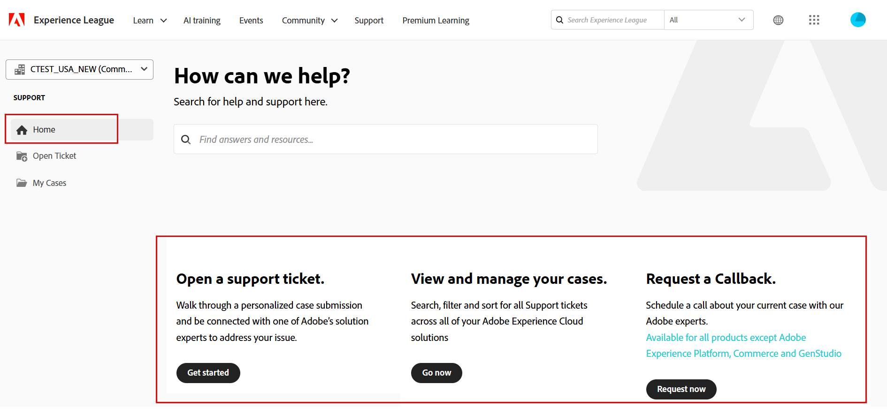
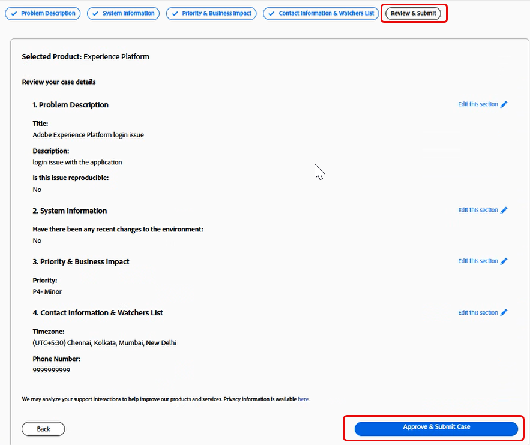

# Experiencia de asistencia al cliente de Adobe

## Tickets de asistencia de Experience League

Los tickets de asistencia ahora se envían a través de [Experience League](https://experienceleague.adobe.com/home?lang=es#support). Para obtener instrucciones sobre cómo enviar un ticket de soporte, revisa la sección [envío de un ticket de soporte](#create-a-support-ticket-with-experience-league).

Estamos trabajando para mejorar la forma en que interactúa con la Asistencia al cliente de Adobe. Nuestro objetivo es optimizar la experiencia de asistencia pasando a un único punto de entrada mediante Experience League. Una vez que esté activa, su organización podrá acceder fácilmente a Asistencia al cliente de Adobe; tener una mayor visibilidad de su historial de servicios a través de un sistema común de todos los productos; y solicitar ayuda por teléfono, web y chat a través de un único portal.

Si es un usuario de Adobe Commerce, consulte [Enviar un caso de asistencia](https://experienceleague.adobe.com/es/docs/commerce-knowledge-base/kb/help-center-guide/magento-help-center-user-guide#support-case) en la Guía del usuario de asistencia de Experience League para Adobe Commerce.

## Compatibilidad con las funciones necesarias para el envío de casos {#submit-ticket}

Para enviar un ticket de asistencia en [Experience League](https://experienceleague.adobe.com/home?lang=es#support), necesita que un administrador del sistema le asigne la función de administrador de asistencia. Solo un administrador del sistema de su organización puede asignar esta función. El producto, el perfil de producto y otros roles administrativos no pueden asignar el rol de administrador de soporte técnico y no pueden ver la opción **[!UICONTROL Crear caso]** que se usó para enviar un ticket de soporte. Para obtener más información sobre los distintos tipos de funciones de administrador y sus derechos, consulte [Funciones de administrador](admin-roles.md).

Si está en Commerce, el proceso para compartir el acceso para trabajar con casos de asistencia es diferente. Para obtener más información, consulte [Acceso compartido: otorga privilegios para que otros usuarios accedan a tu cuenta](https://experienceleague.adobe.com/es/docs/commerce-knowledge-base/kb/help-center-guide/magento-help-center-user-guide#shared-access) en la Guía del usuario de asistencia de Experience League para Adobe Commerce.

### Añadir asistencia da derecho a los roles a una organización

La función de administrador de asistencia es una función no administrativa que tiene acceso a información relacionada con la asistencia. Los administradores de asistencia pueden ver, crear y administrar informes de problemas.

Para agregar o invitar a un administrador:

1. En Admin Console, elija **[!UICONTROL Usuarios]** > **[!UICONTROL Administradores]**.
1. Haga clic en **[!UICONTROL Agregar administrador]**.
1. Introduzca un nombre o una dirección de correo electrónico.

   Puede buscar usuarios existentes o agregar nuevos especificando una dirección de correo electrónico válida y rellenando la información de la pantalla.

   

1. Haga clic en **[!UICONTROL Siguiente]**. Aparecerá una lista de funciones de administrador.

Para asignar una función de administrador de soporte a un usuario (permitir que un usuario pueda ponerse en contacto con el servicio de asistencia):

1. Seleccione la opción **[!UICONTROL Administrador de asistencia]**.

   

1. Elija una de las dos opciones siguientes:

   * Opción 1: **[!UICONTROL administrador de soporte básico]**. Seleccione esta opción si desea proporcionar al soporte técnico acceso para todas las soluciones (excepto Marketo Engage).
   * Opción 2: **[!UICONTROL Administrador de soporte técnico]**: Seleccione esta opción para el soporte técnico de Marketo Engage. Seleccione las instancias de Marketo Engage que darán acceso a la asistencia al usuario.

   

1. Una vez que haya realizado las selecciones, haga clic en **[!UICONTROL Guardar]**.

El usuario recibe una invitación por correo electrónico en relación con los nuevos privilegios administrativos de `message@adobe.com`.

Los usuarios deben hacer clic en **Empezar** en el correo electrónico para unirse a la organización. Si los nuevos administradores no usan el vínculo **Introducción** en la invitación por correo electrónico, no podrán iniciar sesión en Admin Console.

Como parte del proceso de inicio de sesión, se puede pedir a los usuarios que configuren un perfil de Adobe si aún no lo tienen. Si los usuarios tienen varios perfiles asociados a su dirección de correo electrónico, deben elegir **Unirse al equipo** (si se le solicita) y luego seleccionar el perfil asociado a la nueva organización.

Para obtener más información, siga las instrucciones de [editar rol de administrador de empresa](admin-roles.md#add-enterprise-role) de la documentación de roles administrativos. Tenga en cuenta que solo un administrador del sistema de su organización puede asignar esta función. Para obtener más información sobre la jerarquía administrativa, visite la documentación de [funciones administrativas](admin-roles.md).

### Creación de un ticket de asistencia con Experience League

>[!NOTE]
>
> Antes de enviar un ticket de asistencia, compruebe el rendimiento del sistema Adobe, la disponibilidad y los problemas conocidos en el sitio [Adobe status](https://status.adobe.com/es).

Experience League es un portal de asistencia de autoservicio diseñado para proporcionar asistencia personalizada y una experiencia fácil de usar para clientes cualificados.

1. Para crear un ticket en [Experience League](https://experienceleague.adobe.com/home?lang=es#support), selecciona la pestaña **[!UICONTROL Soporte]** en la barra de navegación superior.

   

1. Desde el menú **[!UICONTROL Inicio]**, puedes **[!UICONTROL Abrir un ticket de soporte]**, **[!UICONTROL Ver y administrar tus casos]**, **[!UICONTROL Solicitar una devolución de llamada]** o acceder a recursos de aprendizaje adicionales.

   La opción **[!UICONTROL Solicitar devolución de llamada]** le permite programar reuniones web con uso compartido de pantalla, lo que permite resolver problemas de forma más rápida y eficaz. Está disponible para Adobe Experience Manager, Campaign y Workfront. Se pueden programar reuniones según convenga al cliente y se le pueden invitar al instante. En los casos de Adobe Experience Manager P1, las llamadas de retorno inmediatas están garantizadas para permitir una participación rápida durante los problemas críticos, lo que ayuda a minimizar el tiempo de inactividad y el impacto en la empresa.

   

1. Para enviar un caso, selecciona **[!UICONTROL Abrir un ticket de asistencia]**. También puede seleccionar **[!UICONTROL Abrir incidencia]** en el menú de la barra lateral.

   

### Rellene el ticket de asistencia

Después de seleccionar **[!UICONTROL Abrir una incidencia de soporte técnico]** o **[!UICONTROL Abrir incidencia]**, aparece el formulario para la creación de casos.

El formulario utiliza un flujo de trabajo guiado de varios pasos que le ayuda a proporcionar la información necesaria para que el Soporte de Adobe pueda solucionar el problema de forma eficaz. Puede desplazarse por el formulario mediante las siguientes secciones:

* Selección de productos
* Descripción del problema
* Prioridad e impacto empresarial
* Información de contacto y lista de observadores
* Revisar y enviar

También puede **alternar entre secciones** para actualizar la información antes de enviar el caso.

Siga estos pasos para crear un vale de soporte:

1. Haga clic en el nombre del producto para seleccionar el producto afectado y, a continuación, haga clic en **[!UICONTROL Siguiente]**.

   

1. En la sección **[!UICONTROL Descripción del problema]**, escriba una descripción del problema. El título del caso se genera automáticamente en función de la descripción del problema. Puede editar el título si es necesario. Confirme si el problema se puede reproducir. Seleccione **Sí** si el problema es reproducible. Aparece un cuadro de texto donde puede describir los pasos necesarios para reproducir el problema. Seleccione **No** si el problema no se puede reproducir de manera consistente.

   

   Incluir detalles como:

   * Lo que está intentando hacer
   * Lo que no funciona como se esperaba
   * Pasos que ya ha realizado
   * Si el problema es reproducible

   A medida que introduce la descripción del problema, Experience League muestra recomendaciones impulsadas por IA en un panel junto al formulario. Estas recomendaciones:

   * Sugerir documentación relevante o soluciones conocidas
   * Ayudarle a confirmar si el problema ya se ha solucionado
   * Reduzca la necesidad de enviar un caso por problemas comunes

   El panel aparece sin interrumpir el proceso de creación de casos. Puede revisar las recomendaciones en cualquier momento y seguir enviando el caso si es necesario.

   >[!NOTE]
   >
   >Para generar recomendaciones, la **descripción del problema debe contener al menos 50 caracteres**. Un contador de caracteres en tiempo real le ayuda a realizar el seguimiento de los requisitos mínimos.

   

1. Haga clic en **[!UICONTROL Siguiente]**.

   

1. En la sección **[!UICONTROL Información del sistema]**, proporcione la **[!UICONTROL Versión del producto]**, **[!UICONTROL Entorno]**, **[!UICONTROL Oferta de productos]** e indique si se han realizado cambios recientes en el entorno o la instancia. Seleccione **Sí** para proporcionar detalles adicionales sobre los cambios. Seleccione **No** si no se realizó ningún cambio y haga clic en **[!UICONTROL Siguiente]**.

   >[!NOTE]
   >
   > En función del producto seleccionado, pueden aparecer campos adicionales. Estos campos incluyen detalles sobre el entorno en el que se produce el problema.

   

1. En la sección **[!UICONTROL Prioridad e impacto empresarial]**, seleccione lo siguiente:
   * Prioridad De Caso (P4 - Menor, P3 - Importante, P2 - Urgente, P1 - Crítico)
   * Proporcione los detalles de Impacto empresarial cuando la prioridad seleccionada sea P1 - Crítico y, a continuación, haga clic en **[!UICONTROL Siguiente]**.

   

   Para obtener más información sobre cómo la prioridad de casos y el impacto en la empresa afectan los tiempos de respuesta de soporte, consulte [Tiempos de respuesta iniciales objetivo para el soporte](https://experienceleague.adobe.com/es/docs/support-resources/data-sheets/overview#targeted-initial-response-times-for-support) en la documentación de Recursos de planes de éxito.

1. En la sección **[!UICONTROL Lista de vigilantes e información de contacto]**, selecciona la zona horaria, escribe tu número de teléfono, agrega vigilantes, adjunta los archivos que necesites y, a continuación, haz clic en **[!UICONTROL Siguiente]**.

   

1. En la sección **[!UICONTROL Revisar y enviar]**, revise los detalles de su caso y haga clic en **[!UICONTROL Aprobar y enviar caso]**.

   

   El paso **[!UICONTROL Revisar y enviar]** resume toda la información ingresada y le permite:

   * Revise todos los detalles del caso en un solo lugar
   * Vuelva a cualquier paso anterior para realizar modificaciones
   * Volver al resumen de revisión sin perder progreso

Después del envío:

* El caso está registrado en Experience League
* Puede realizar un seguimiento de las actualizaciones y comunicarse con el Soporte técnico a través del portal
* El Soporte de Adobe responde en función de la prioridad y el impacto que haya proporcionado

>[!TIP]
>
> Si no ve la opción **[!UICONTROL Abrir incidencia]** o la ficha **[!UICONTROL Asistencia]**, póngase en contacto con el administrador del sistema para asignar la función de administrador de asistencia.

>[!NOTE]
>
> Si el problema causa interrupciones o interrupciones graves en un sistema de producción, se proporciona un número de teléfono para obtener asistencia inmediata.