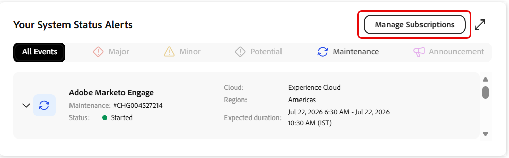
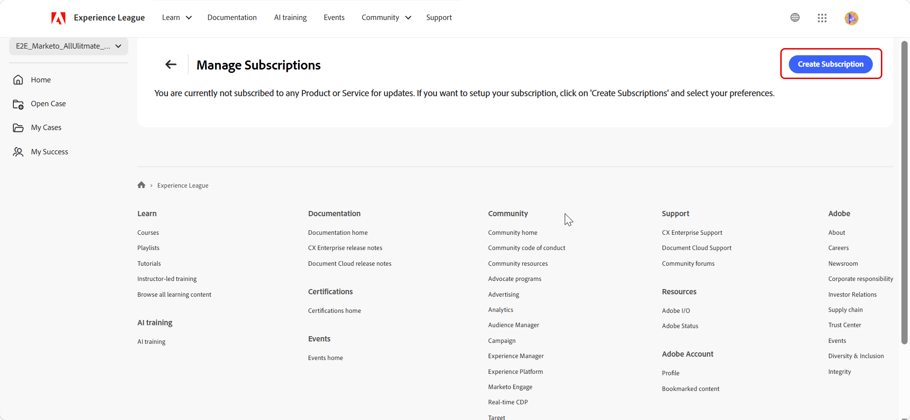
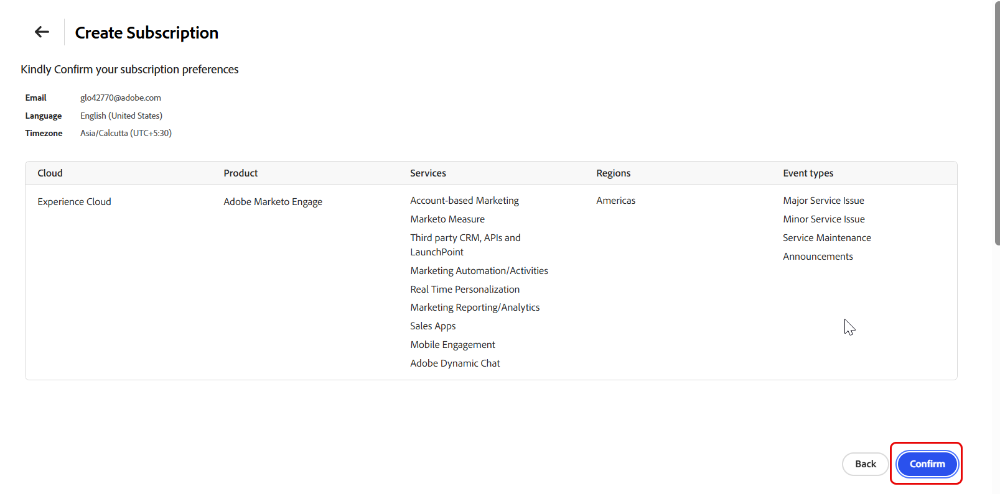

# Portal de asistencia de Experience League: nueva interfaz de usuario

## Información general

El portal de asistencia de Experience League rediseñado proporciona una experiencia unificada e intuitiva para la administración de actividades de asistencia de Adobe. Ofrece un acceso más rápido a las funciones esenciales, incluido el seguimiento de los casos de asistencia, la monitorización del estado del producto, el acceso a las perspectivas de casos y la conexión con el equipo de éxito.

>[!NOTE]
>
>Para crear y administrar casos de soporte en el portal rediseñado, consulte [Crear y administrar casos de soporte](exl-new-ui-support-cases.md).

## Página principal

La página **[!UICONTROL Home]** sirve como sistema centralizado para las actividades de soporte. Proporciona una descripción general del entorno de soporte y un acceso rápido a las funciones clave.

El panel de navegación izquierdo proporciona acceso a las siguientes secciones:

- **[!UICONTROL La página de inicio]** se abre como la página de aterrizaje predeterminada y muestra una vista centralizada de la actividad de soporte técnico.
- **[!UICONTROL Abrir caso]** abre el flujo de trabajo de creación de casos en el portal rediseñado. Ver [Crear y administrar casos de soporte](exl-new-ui-support-cases.md).
- **[!UICONTROL Mis casos]** abre la lista de casos en el portal rediseñado. Ver [Crear y administrar casos de soporte](exl-new-ui-support-cases.md).
- **[!UICONTROL Mi éxito]** solo está disponible para los clientes de Ultimate Success plan.

## Cambio de organizaciones

Si está asociado con varias organizaciones, use el **conmutador de organización** ubicado en la esquina superior izquierda del portal.

El cambio de organizaciones actualiza los datos de casos, el estado del producto y la información de asistencia en todo el portal para reflejar la organización seleccionada.

## Cambio entre portales

Utilice la opción del portal para cambiar entre el portal de asistencia de Experience League rediseñado y el portal actual.

Ambos portales permanecen sincronizados, lo que garantiza que los datos de los casos y la información de asistencia sean coherentes en todas las experiencias.

>[!NOTE]
>
>Las preferencias del portal se guardan automáticamente. El portal que utilizó por última vez se convierte en el portal predeterminado para los inicios de sesión futuros. Si utilizó por última vez el portal rediseñado, se abrirá directamente sin cargar el portal heredado. Si utilizó por última vez el portal heredado, el sistema lo abrirá.

La página de inicio incluye un banner de bienvenida personalizado con una barra de búsqueda global que permite realizar búsquedas en el portal de asistencia de Experience League.

Las siguientes acciones rápidas están disponibles en la parte superior de la página **[!UICONTROL Inicio]**:

1. **[!UICONTROL Abrir un caso de soporte técnico]**: abre el flujo de trabajo de creación de casos en el portal rediseñado. Seleccione **[!UICONTROL Introducción]**.

1. **[!UICONTROL Ver y administrar sus casos]** — Abre la página **[!UICONTROL Mis casos]** en el portal rediseñado. Seleccione **[!UICONTROL Ir ahora]**.

1. **[!UICONTROL Solicitar una devolución de llamada]** - Programe una llamada sobre el caso con un experto en Adobe. Para casos P1 (críticos), solicite una llamada de retorno inmediata. Para los casos P2 y P3, programe una reunión en la web con un ingeniero de asistencia técnica en una fecha y hora convenientes. Seleccione **[!UICONTROL Solicitar ahora]** para comenzar.

## Análisis de servicio

La sección **[!UICONTROL Service Analytics]** muestra un resumen de la actividad del caso de asistencia. Utilice el selector de vista para cambiar entre **[!UICONTROL Mis casos]** y **[!UICONTROL Mis casos de organización]**:

- **[!UICONTROL Mis casos]** — Muestra estadísticas de casos específicos del individuo.
- **[!UICONTROL Mis casos de organización]**: muestra las estadísticas de mayúsculas y minúsculas de la organización seleccionada.

La vista seleccionada se aplica a todas las métricas y gráficos de esta sección, incluidas las secciones [[!UICONTROL Recuento de casos por prioridad]](#cases-count-by-priority) y [[!UICONTROL Mis casos enviados]](#my-submitted-cases).

La sección **[!UICONTROL Service Analytics]** proporciona las siguientes métricas:

- **[!UICONTROL Casos de respuesta pendientes]**: Muestra el número de casos que esperan una respuesta.
- **[!UICONTROL Casos enviados]** — Muestra el número total de casos enviados.

## Recuento de casos por prioridad

Esta sección muestra un desglose visual de los casos de asistencia por nivel de prioridad.

La selección de **[!UICONTROL Mis casos]** y **[!UICONTROL Mis casos de organización]** en la sección **[!UICONTROL Análisis de servicios]** se aplica a este gráfico y permite la visualización a nivel individual u organizativo.

Pase el ratón sobre un segmento prioritario para ver una información de objeto que muestre lo siguiente:

- Número total de casos para ese nivel de prioridad
- Número de casos abiertos
- Número de casos cerrados

## Mis casos enviados

Esta sección muestra los tres casos de asistencia técnica enviados más recientemente, entre los que se incluyen:

- ID de caso
- Título del caso
- Prioridad
- Fecha de envío
- Estado

Cuando se selecciona **[!UICONTROL Mis casos]** en **[!UICONTROL Service Analytics]**, esta sección muestra los tres casos enviados más recientemente. Cuando se seleccionan **[!UICONTROL Mis casos de organización]** en la sección **[!UICONTROL Análisis de servicios]**, se muestran los tres casos enviados más recientemente en toda la organización.

Seleccione un **[!UICONTROL ID de caso]** para ver los detalles de caso en el portal de asistencia de Experience League rediseñado.

Seleccione **[!UICONTROL Ver todos los casos]** para abrir la página **[!UICONTROL Mis casos]** en el portal de soporte técnico rediseñado de Experience League.

Cuando se selecciona **[!UICONTROL Mis casos]** en **[!UICONTROL Service Analytics]**, se preseleccionan **[!UICONTROL Mis casos (todos)]**, que se abre en el portal de asistencia de Experience League. Cuando se seleccionan **[!UICONTROL Mis casos de organización]**, **[!UICONTROL Los casos de mi organización (todos)]** se preseleccionan en el portal de asistencia de Experience League.

## Alertas de estado del producto

Esta sección muestra el estado operativo actual de los productos de Adobe asignados a la organización.

Un estado de **[!UICONTROL Disponible]** indica que el producto está completamente operativo sin interrupciones activas. Si hay uno o más problemas, el número total de problemas activos aparece en la tarjeta de producto.

Los productos aparecen en el siguiente orden:

1. Productos con problemas activos
1. Productos restantes, enumerados por orden alfabético

Esta priorización ayuda a identificar y priorizar rápidamente los productos que requieren atención. Puede seleccionar una o más tarjetas de producto para filtrar las alertas en **[!UICONTROL Alertas de estado del sistema]** en la página **[!UICONTROL Inicio]**.

## Sus alertas de estado del sistema

Esta sección muestra alertas en tiempo real de los productos de Adobe. Puede filtrar las alertas por tipo de evento mediante las siguientes pestañas:

- Principal
- Menor
- potencial
- Mantenimiento
- Anuncios

Cada alerta incluye lo siguiente:

- Número de problema
- Nube
- Región
- Estado
- Hora de inicio y finalización de la referencia

Seleccione una alerta para ampliarla y ver detalles adicionales.

### Administrar suscripciones

Use **[!UICONTROL Manage Subscriptions]** para configurar las notificaciones por correo electrónico de los eventos de estado de los productos y servicios de Adobe. Las suscripciones le ayudan a mantenerse informado cuando Adobe crea, actualiza o resuelve eventos para productos y regiones seleccionados.

1. En la sección **[!UICONTROL Alertas de estado del sistema]**, seleccione **[!UICONTROL Administrar suscripciones]**.

   

1. En la página **[!UICONTROL Administrar suscripciones]**, seleccione **[!UICONTROL Crear suscripción]**.

   

1. En **[!UICONTROL Seleccione la nube]**, seleccione la nube de Adobe que contiene el producto que desea supervisar.
1. En **[!UICONTROL Seleccione Producto y ofertas]**, seleccione el producto para el que desea recibir notificaciones.
1. En **[!UICONTROL Seleccione regiones]**, seleccione una o más regiones para supervisar.
1. En **[!UICONTROL Seleccione los tipos de eventos]**, seleccione uno o más de los siguientes tipos de eventos:

   &#x200B;* Problema de servicio importante
   &#x200B;* Problema de servicio menor
   &#x200B;* Mantenimiento de servicio
   &#x200B;* Anuncios

   

1. Revise la configuración de notificaciones predeterminada, incluidos el idioma y la zona horaria.
1. Seleccione **[!UICONTROL Continuar]**.
1. Revise los detalles de la suscripción, incluidos la nube, el producto, los servicios, las regiones y los tipos de evento seleccionados.
1. Seleccione **[!UICONTROL Confirmar]** para crear la suscripción.

   

1. Aparecerá un mensaje de confirmación y se creará la suscripción.

Una vez creada la suscripción, Adobe envía notificaciones por correo electrónico cuando se crean, actualizan o resuelven eventos que coinciden con los criterios seleccionados del producto, la región y el tipo de evento.

>[!NOTE]
>
>El correo electrónico es el canal de comunicación predeterminado para las notificaciones de estado. Las preferencias de suscripción solo se aplican al producto, las regiones y los tipos de evento seleccionados.

La próxima vez que abra **[!UICONTROL Administrar suscripciones]**, la página mostrará los detalles de la suscripción actual, incluidos la nube, el producto, los servicios, las regiones y los tipos de eventos seleccionados.

Desde esta página, puede realizar las siguientes acciones:

&#x200B;* Seleccione **[!UICONTROL Editar suscripción]** para modificar una suscripción existente.
&#x200B;* Seleccione **[!UICONTROL Cancelar la suscripción a todas]** para eliminar todas las suscripciones.
&#x200B;* Seleccione el icono de eliminación situado junto a una suscripción para eliminar una suscripción individual.

## Información de su plan

Esta sección muestra detalles clave sobre el plan de soporte (Ultimate Success plan y Expert Success plan) y los beneficios disponibles. Seleccione **[!UICONTROL Más información]** para explorar toda la gama de ofertas de planes.

## Mi éxito

La página **[!UICONTROL Mi éxito]** proporciona una vista personalizada de la participación con Adobe. Ofrece acceso directo al equipo de éxito, a los beneficios del programa y a los recursos de aprendizaje.

>[!NOTE]
>  
>Esta página solo está disponible para clientes con el plan **[!UICONTROL Ultimate Success]**.

La página incluye lo siguiente:

- Un mensaje de bienvenida que describe cómo Ultimate Success proporciona liderazgo estratégico y soporte técnico proactivo para la salud a fin de ofrecer experiencias digitales de alto rendimiento
- Opción **[!UICONTROL Ver vídeo]** para obtener más información sobre el plan
- Componentes clave del plan, entre los que se incluyen:
  - **[!UICONTROL Equipo de éxito]**
  - **[!UICONTROL Aceleradores de éxito]**
  - **[!UICONTROL Mutual Action Plan]**

También permite acceder a recursos de aprendizaje, como Experience League, la comunidad de Experience League y las suscripciones de aprendizaje premium.

### Equipo de éxito de Adobe

Esta sección muestra su equipo de éxito de Adobe dedicado. Seleccione **[!UICONTROL Contacto]** junto a un miembro del equipo para enviar un correo electrónico.

