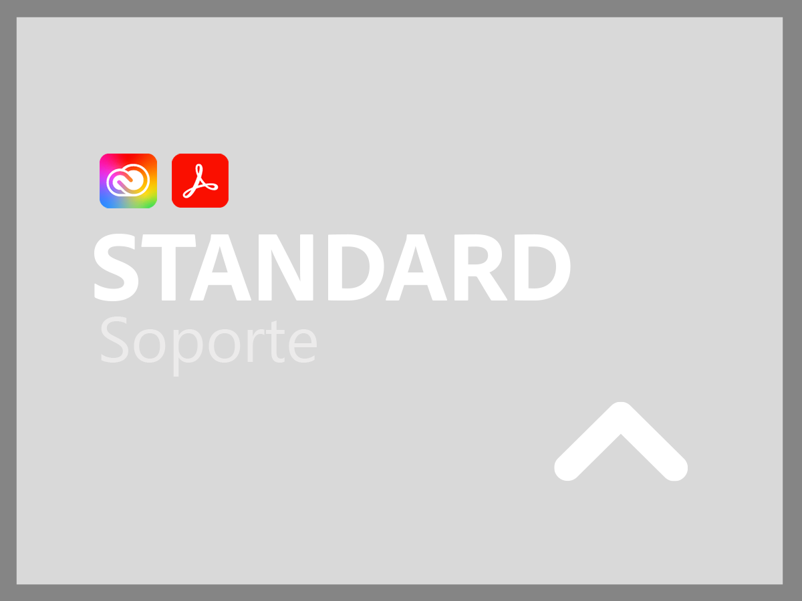
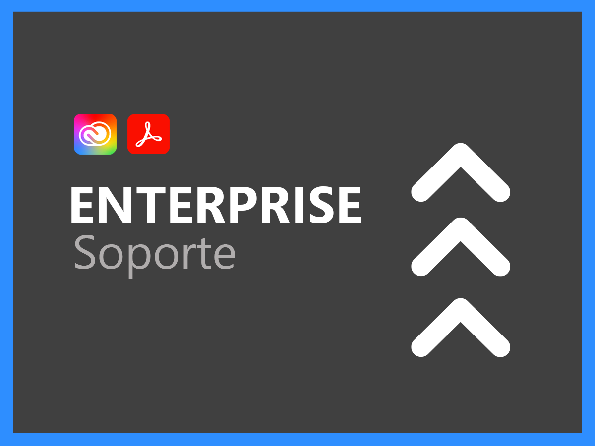
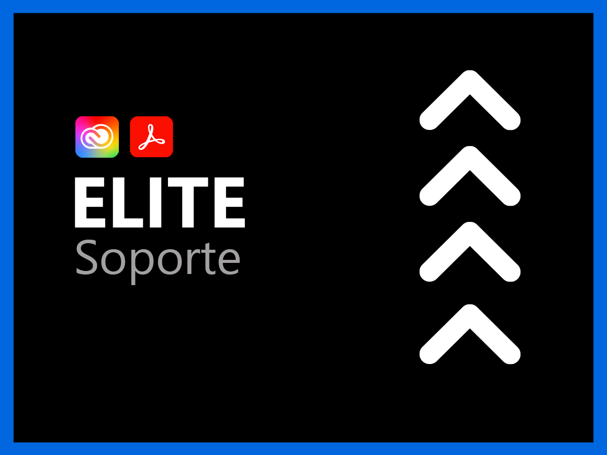

# Servicios de soporte para Creative Cloud Enterprise y Document Cloud

La organización de soporte al cliente de Adobe Creative Cloud y Document Cloud está comprometida con su éxito. Todas las aplicaciones incluyen un nivel de soporte que facilita el acceso a nuestros recursos técnicos altamente calificados para ofrecer asistencia técnica.

Para necesidades más completas, ofrecemos planes de Soporte de Adobe que incluyen acceso a profesionales de soporte particulares y sesiones de tutoría proactivas y revisiones de servicio. Independientemente de lo complejas que puedan ser sus necesidades de soporte, Adobe ofrece la experiencia técnica y operativa necesaria para ayudarle a lograr el máximo rendimiento y sacarle el valor óptimo a su aplicación de Adobe.

<table style="table-layout:fixed">
<tr>
  <td>
    
    

    <a href="dme-standard.md"><strong>Soporte Standard</strong></a> (ver <a href="assets/DMeStandardSupportDatasheet_2022.pdf" target="_blank">PDF</a>)
    

    
Acceso continuo para usuarios autorizados (administradores) a nuestros equipos de soporte técnico a través de chat o teléfono, así como la capacidad de registrar solicitudes de ayuda por nuestro portal web de soporte. 

     
  </td>
  <td>
    
    

    <a href="dme-business.md"><strong>Soporte Business</strong></a> (consulte el <a href="assets/DMeBusinessSupportDatasheet_2022.pdf" target="_blank">PDF</a>)
    

    
Enrutamiento prioritario de los casos de soporte para garantizar una conexión más rápida a una asistencia de mayor nivel y la capacidad de recurrir a un jefe de soporte de cuenta para recibir comunicaciones y actualizaciones periódicas sobre sus solicitudes de soporte más importantes.

     
  </td>
</tr>
<tr>
  <td>
    
    

    <a href="dme-enterprise.md"><strong>Soporte Enterprise</strong></a> (consulte el <a href="assets/DMeEnterpriseSupportDatasheet_2022.pdf" target="_blank">PDF</a>)
    

    
El contacto técnico designado en el Equipo de soporte de Adobe, con una amplia experiencia en la solución, trabajará con usted y sus equipos técnicos para garantizar la resolución oportuna de todas las solicitudes de asistencia.

     
  </td>
  <td>
    
    

    <a href="dme-elite.md"><strong>Soporte Elite</strong></a> (consulte el <a href="assets/DMeEliteSupportDatasheet_2022.pdf" target="_blank">PDF</a>)
    

    
Se ha designado un contacto técnico en el Equipo de soporte de Adobe y un administrador de cuentas técnico que trabajará con usted para proporcionarle el mejor soporte proactivo. El objetivo es garantizar que maximice su inversión y ayudarlo a evitar problemas antes de que ocurran.

     
  </td>
</tr>
</table>

