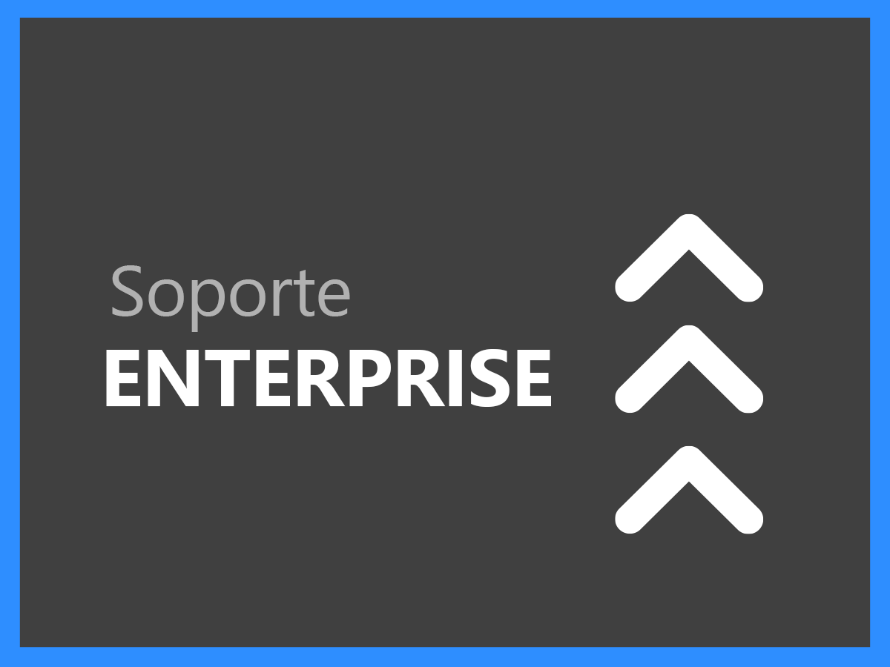
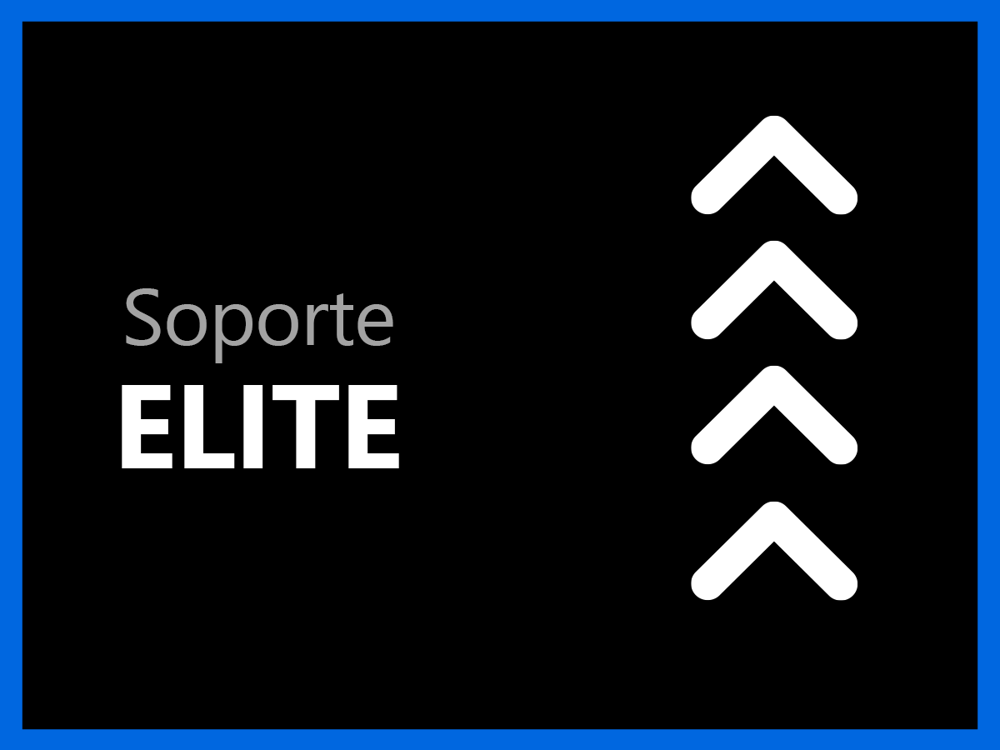

# Información general sobre los servicios de asistencia al Experience Cloud

La organización de la asistencia al cliente de Adobe Experience Cloud tiene como objetivo que usted logre el éxito. Todas las suscripciones incluyen un nivel de asistencia que facilita el acceso a nuestros recursos técnicos altamente calificados para ofrecer asistencia técnica.

Para necesidades más completas, ofrecemos servicios de soporte de Adobe que incluyen acceso a profesionales de soporte particulares, objetivos de respuesta acelerados en el nivel de servicio, y sesiones de tutoría proactivas y revisiones de servicio. Independientemente de lo complejas que puedan ser sus necesidades de soporte, Adobe ofrece la experiencia técnica y operativa necesaria para ayudarle a lograr el máximo rendimiento y sacarle el valor óptimo a su solución de Adobe.

<table style="table-layout:fixed">
<tr>
  <td>
    
    

    <a href="online.md"><strong>Soporte Online</strong></a> (consulte el <a href="assets/OnlineSupportDatasheet.pdf" target="_blank">PDF</a>)
    

    
Acceso limitado a asistencia telefónica

     
  </td>
  <td>
    
    

    <a href="business.md"><strong>Soporte Business</strong></a> (consulte el <a href="assets/BusinessSupportDatasheet.pdf" target="_blank">PDF</a>)
    

    
Acceso completo a los equipos de asistencia técnica de Adobe y a un responsable de la asistencia técnica de la cuenta para la administración de cuentas

     
  </td>
</tr>
<tr>
  <td>
    
    

    <a href="enterprise.md"><strong>Soporte Enterprise</strong></a> (consulte el <a href="assets/EnterpriseSupportDatasheet.pdf" target="_blank">PDF</a>)
    

    
Objetivos de nivel de servicio (SLT, por sus siglas en inglés) de asistencia mejorados, beneficios de experiencia técnica y un ingeniero de asistencia técnica especializado

     
  </td>
  <td>
    
    

    <a href="elite.md"><strong>Soporte Elite</strong></a> (consulte el <a href="assets/EliteSupportDatasheet.pdf" target="_blank">PDF</a>)
    

    
Los mejores objetivos de nivel de servicio (SLT, por sus siglas en inglés), soporte proactivo, y asociación con un gestor técnico de cuentas y un ingeniero de asistencia técnica especializado

     
  </td>
</tr>
</table>

