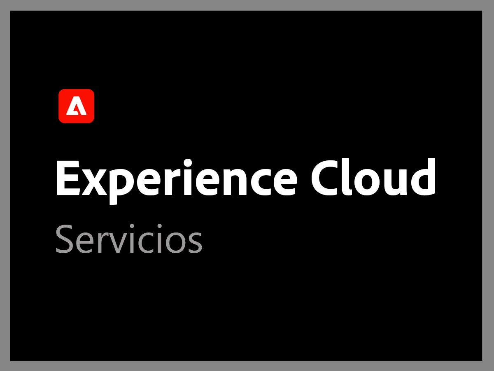
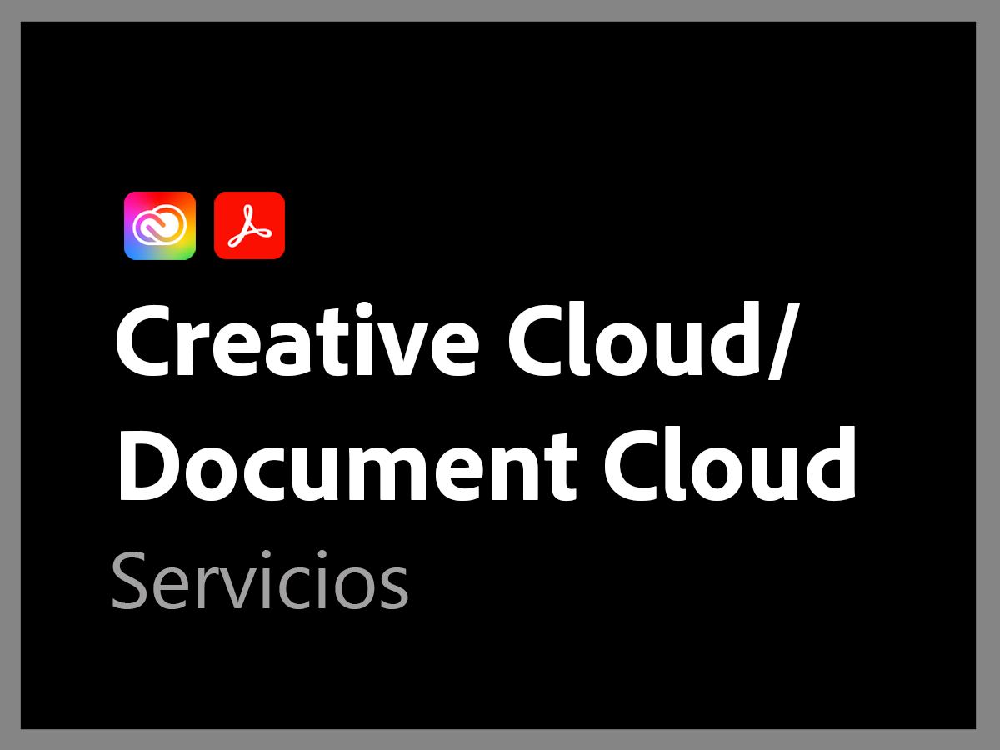

# Información general sobre la compatibilidad con Adobe

La organización de asistencia al Adobe está comprometida con su éxito. Todas las suscripciones incluyen un nivel de asistencia que facilita el acceso a nuestros recursos técnicos altamente calificados para ofrecer asistencia técnica.

Para necesidades más completas, ofrecemos servicios de soporte de Adobe que incluyen acceso a profesionales de soporte y sesiones con nombres específicos para tutoría proactiva y revisiones de servicio. Independientemente de lo complejas que puedan ser sus necesidades de soporte, Adobe ofrece la experiencia técnica y operacional necesaria para ayudarle a lograr el máximo rendimiento y el valor óptimo de su solución de Adobe.

<table style="table-layout:fixed">
<tr>
  <td>
    
    

    <a href="dx-overview.md"><strong>Asistencia de Experience Cloud</strong></a>
    

    
Opciones de asistencia para productos de Experience Cloud y Experience Platform

     
  </td>
  <td>
    
    

    <a href="dme-overview.md"><strong>Compatibilidad con documentos y Enterprise de Creative Cloud</strong></a>
    

    
Opciones de asistencia para productos de Creative Cloud y Document Cloud

     
  </td>
</tr>
</table>
